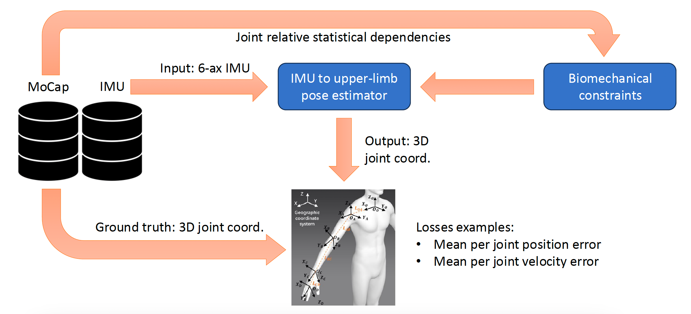
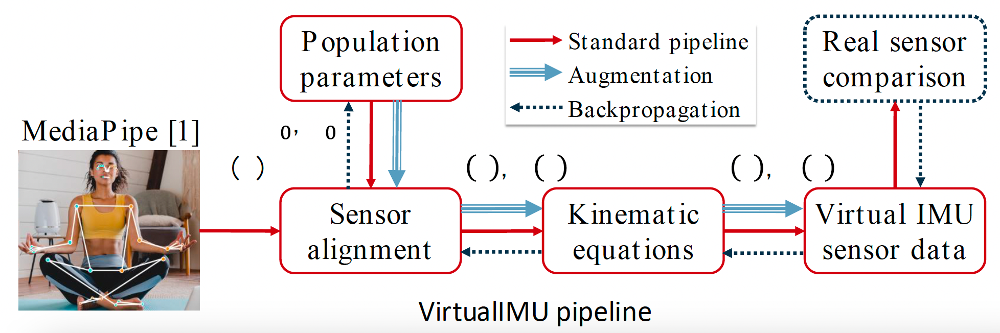

# Upper-Limb Pose Prediction using Six-Axis Wrist-Worn IMUs

## 📌 Topic
This project focuses on predicting arm gestures (e.g., skeletal model) using wrist-worn devices. 

## 🎯 Goal
Develop and evaluate a machine learning model that maps wrist-worn IMU data to 3D upper-limb joint positions.

## 📂 Dataset

- [AMASS](https://amass.is.tue.mpg.de/)
- [GRAB](https://grab.is.tue.mpg.de/)

The datasets include high-quality MoCap data and body models (e.g., SMPL, SMPL+H) suitable for upper-limb joint tracking tasks.

## ⚙️ Project Steps

### 1. ✅ Data Preparation
The data has already been preprocessed to save time. You can download the prepared data from the following Google Drive link:
[🔗 Preprocessed Dataset](https://drive.google.com/file/d/1v48UuEhwlC4UUOpxG6x3nNzSg1uvTDgJ/view?usp=sharing)

### 2. 🧠 Model Training
We train a machine learning model to predict 3D joint positions from the 6-axis IMU data.

- **Input**: 6-axis IMU sequences (acceleration + gyroscope)
- **Output**: 3D joint coordinates (MoCap format)
- **Bio-mechanical constraints**: Constraints introduced to the model to ensure physiologically plausible predictions, such as preventing elbow joints from extending beyond 180 degrees.

### 3. 📊 Evaluation & Visualization

We evaluate the model using quantitative metrics such as:
- Mean per joint position error
- Mean per velocity error

#### 📽 Visualization Ideas
To effectively demonstrate model performance, consider visualizing predicted motions:
- **Skeleton overlays** (ground-truth vs prediction)
- **3D animated skeleton sequences**
- **Error heatmaps across joints or frames**

💡 *Tip*: Use `matplotlib.animation` to animate skeletons frame by frame. You can refer to the "Visualize MoCap" section in the Jupyter notebook for starter code.

## 🛰️ VirtualIMU: Synthesizing IMU Data from MoCap

📄 [IEEE Paper: VirtualIMU](https://ieeexplore.ieee.org/document/10331242)

VirtualIMU is a method for generating synthetic IMU data from motion capture (MoCap) sequences.  
Originally, it uses [MediaPipe](https://ai.google.dev/edge/mediapipe/solutions/guide) to get pose from video and convert it to IMU  
However, in our case, since we already have high-quality MoCap data, we can skip MediaPipe and directly use the red path of the VirtualIMU pipeline to convert MoCap into IMU data.
Optionally, for a better sensor alignment, you can optimize the population parameters using backpropagation (dotted lines)
